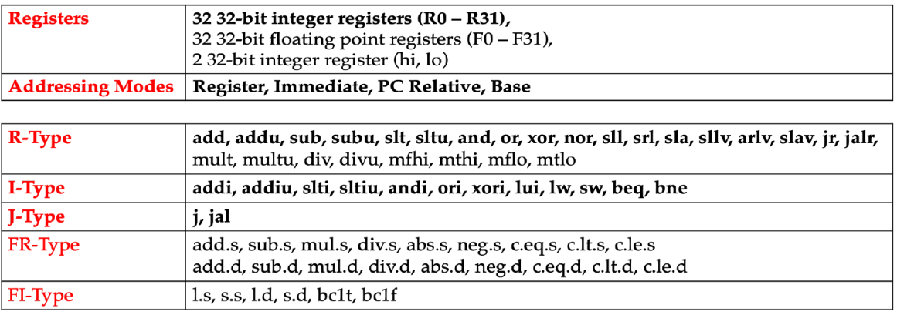

# 5-Stage In-Order MIPS CPU Core

## Overview

This project, part of the Advanced Computer Architecture course, implements a 5-stage in-order MIPS CPU core with a limited set of instructions.

## Features

- 5-stage in-order pipeline
- Limited MIPS instruction set
- Full forwarding (bypassing) logic
- Stall logic implementation
- No dynamic branch prediction
- Separate Instruction and Data Memory (Harvard Architecture)

## Pipeline Stages

1. **Instruction Fetch (IF)**: Fetches the instruction from memory.
2. **Instruction Decode (ID)**: Decodes the fetched instruction and reads the necessary registers.
3. **Execute (EX)**: Performs arithmetic or logical operations.
4. **Memory Access (MEM)**: Accesses memory for load and store instructions.
5. **Write Back (WB)**: Writes the result back to the register file.

## Supported Instructions

The CPU core supports the following limited set of MIPS instructions and addressing modes (Bolded ones):


## Project Structure

- `HW/rtl`: Contains the source code for the CPU core hardware.
- `HW/sim`: Contains the file for simulating the CPU core hardware code in vsim (ModelSim and QuestaSim).
- `HW/tb/testbench`: Contains the System Verilog testbench for the CPU core hardware.
- `SW/`: Contains assembly codes and their Instruction and Data binary memory initialization codes and to verify the functionality of the CPU core.

## Getting Started

To get started with the project, clone the repository and navigate to the project directory:

```sh
git clone <repository-url>
cd ./HW/sim
make 
```

