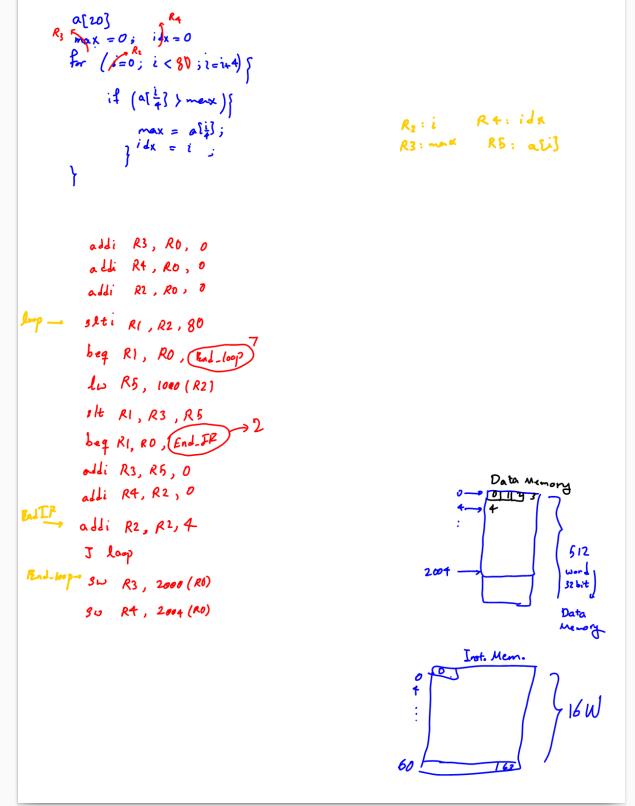
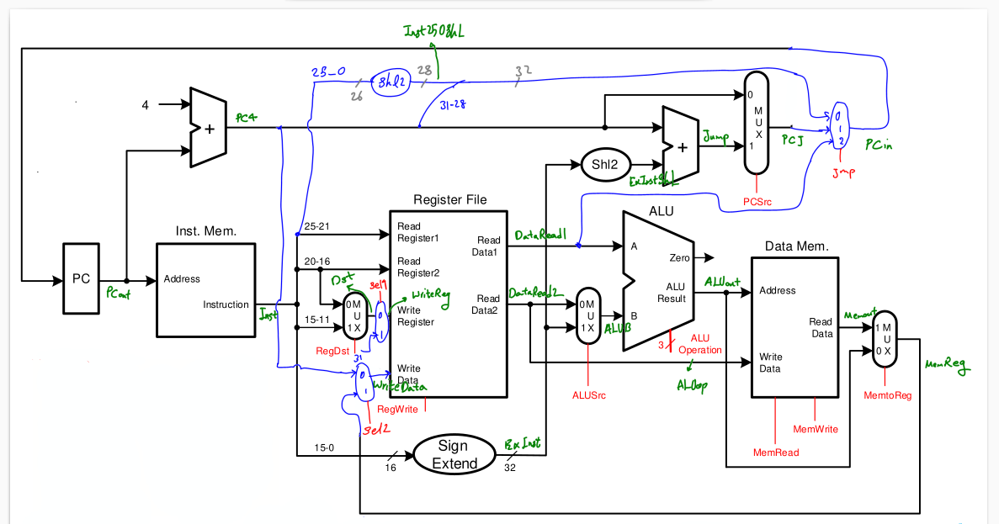
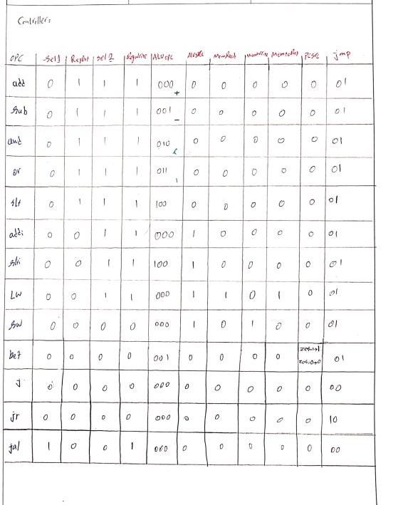

# README for MIPS Single-Cycle Processor Design Project

## Overview
This project involves designing a **single-cycle MIPS processor** based on the specifications provided in the Computer Architecture course (CA#02). The processor supports a subset of MIPS instructions, including arithmetic/logical operations, memory reference instructions, and control flow instructions. The design is tested with a program that finds the **largest element** in a 20-element array and writes the result to memory.

---

## Processor Specifications

### Supported Instructions
The processor supports the following MIPS instructions:

#### Arithmetic/Logical Instructions:
- **add**: Add two registers.
- **sub**: Subtract two registers.
- **and**: Bitwise AND operation.
- **or**: Bitwise OR operation.
- **slt**: Set less than (compare two registers).
- **addi**: Add an immediate value to a register.
- **slti**: Set less than immediate (compare register with immediate value).

#### Memory Reference Instructions:
- **lw**: Load word from memory into a register.
- **sw**: Store word from a register into memory.

#### Control Flow Instructions:
- **j**: Unconditional jump.
- **jal**: Jump and link (used for function calls).
- **jr**: Jump to address in register.
- **beq**: Branch if equal.

### Instruction Encoding
The instructions are encoded as follows:

| Instruction | Opcode | Function |
|-------------|--------|----------|
| add         | 000000 | 000001   |
| sub         | 000000 | 000010   |
| and         | 000000 | 000100   |
| or          | 000000 | 001000   |
| slt         | 000000 | 010000   |
| addi        | 000001 | -        |
| slti        | 000010 | -        |
| lw          | 000011 | -        |
| sw          | 000100 | -        |
| beq         | 000101 | -        |
| j           | 000110 | -        |
| jr          | 000111 | -        |
| jal         | 001000 | -        |

---

## Data Path and Control Unit Design
The processor is designed as a **single-cycle implementation**, where each instruction is executed in one clock cycle. The data path includes the following components:
- **Register File**: Contains 32 general-purpose registers.
- **ALU**: Performs arithmetic and logical operations.
- **Instruction Memory**: Stores the program instructions.
- **Data Memory**: Stores data for load/store operations.
- **Control Unit**: Generates control signals based on the instruction opcode.

### Key Control Signals
- **RegDst**: Determines the destination register for write-back.
- **ALUSrc**: Selects between a register value and an immediate value for the ALU.
- **MemtoReg**: Selects between ALU result and memory data for write-back.
- **RegWrite**: Enables writing to the register file.
- **MemRead**: Enables reading from data memory.
- **MemWrite**: Enables writing to data memory.
- **Branch**: Enables branch instructions.
- **Jump**: Enables jump instructions.

---

## Test Program
The processor is tested with a program that performs the following tasks:
1. Finds the **largest element** in a 20-element array starting at memory address **1000**.
2. Writes the **largest element** to memory address **2000**.
3. Writes the **index of the largest element** to memory address **2004**.

---

## How to Run the Project

### Prerequisites
- **Verilog HDL**: The processor is implemented in Verilog.
- **Simulation Tool**: Use **ModelSim** or **Questasim** for simulation.
- **Test Program**: The test program is written in assembly and should be loaded into the processor's memory.

### Steps to Run the Project
1. **Clone the Repository**:
   - Clone the repository containing the Verilog code for the processor and the test program.

2. **Open the Project in ModelSim/Questasim**:
   - Launch the simulation tool and create a new project.
   - Add all Verilog files (`*.v`) to the project.

3. **Compile the Verilog Code**:
   - Compile all Verilog files. Ensure there are no syntax errors.

4. **Load the Test Program**:
   - Load the test program (assembly or machine code) into the processor's memory. This can be done by initializing the memory module in Verilog with the test program data.

5. **Run the Simulation**:
   - Start the simulation and run it for enough clock cycles to allow the processor to execute the test program fully.

6. **Analyze the Results**:
   - Check memory addresses **2000** and **2004** to verify that the largest element and its index have been correctly written.
   - Inspect the waveform to ensure the processor is functioning as expected.

7. **Debugging (if necessary)**:
   - If the results are incorrect, use the waveform and simulation logs to debug the design.
   - Check control signals, register values, and memory accesses to identify issues.

---
## DataPath

## Controller

## Contact
For any questions or clarifications, please contact me.